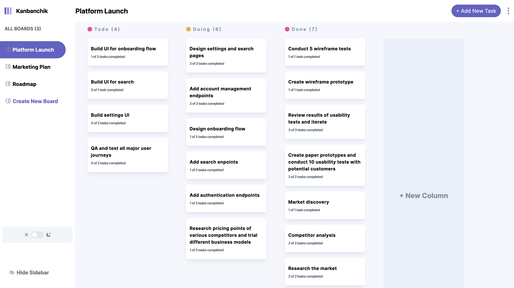

#  Kanban task management web app

## Table of contents

- [Overview](#overview)
  - [The challenge](#the-challenge)
  - [Screenshot](#screenshot)
  - [Links](#links)
- [Built with](#built-with)
 - [Installation](#installation)
- [Author](#author)




## Overview

### The challenge

This is a full stack solution to the kanban challenge on [frontendmentor](https://www.frontendmentor.io/challenges/kanban-task-management-web-app-wgQLt-HlbB) (they provide the design, figma file and assets and the goal is to produce an app)

Users are able to:

- View the optimal layout for the app depending on their device's screen size
- See hover states for all interactive elements on the page
- Create, read, update, and delete boards, columns, tasks and subtasks
- Receive form validations when trying to create/edit boards and tasks
- Mark subtasks as complete and move tasks between columns
- Hide/show the board sidebar
- Toggle the theme between light/dark modes
- Drag and drop tasks to change their status and re-order them in a column

### Screenshot


### Links

- Live Site URL: [Vercel]()

## Built with
- [React](https://react.dev/) - JS library
- [Redux](https://redux.js.org/) - Client-Side State Management Tool
- [Next.js](https://nextjs.org/) - React framework
- [Tailwindcss](https://tailwindcss.com) - CSS framework
- [NextAuth.js](https://next-auth.js.org/) - Authentication library for Next.js

## Installation

First, install all required dependencies:

```
npm install
```

Create a `.env` file inside the `/` folder having the following structure:

```.env
MONGODB_URI=

NEXTAUTH_SECRET=
# run '$ openssl rand -base64 32' in the terminal
NEXTAUTH_URL = http://localhost:3000
# or the link to your website

# Next Auth Google Provider
GOOGLE_CLIENT_ID=
GOOGLE_CLIENT_SECRET=
```
If you want to remove or add auth providers, you have to modify the following files : `/app/api/auth/[...nextauth]/route.js`.

## Running

Run the development server:

```bash
npm run dev
# or
yarn dev
# or
pnpm dev
# or
bun dev
```

Open [http://localhost:3000](http://localhost:3000) with your browser to see the result.


## Author

- Website - [Azamat Salamatov](https://www.azamat.life)